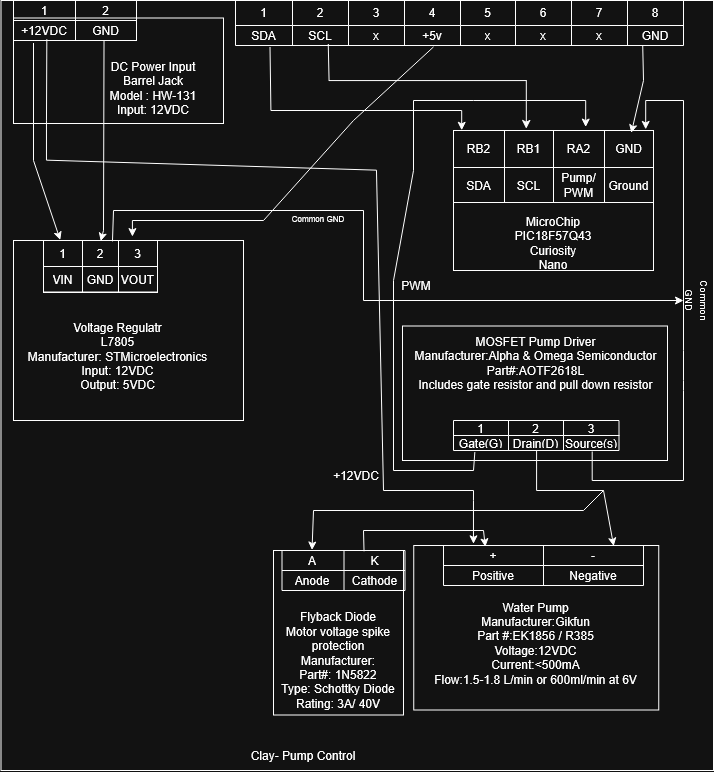

## Overview
This block diagram shows the power, control, and communication connections for the Fill-A-Bot pump control subsystem. The subsystem receives 12VDC through a barrel jack. An L7805 voltage regulator converts the 12VDC input to 5VDC for the control electronics, while the pump operates directly from the 12VDC supply.
The PIC18F57Q43 Curiosity Nano controls the pump using a PWM signal connected to the MOSFET pump driver. The MOSFET switches the 12V water pump on and off and allows the pump speed and flow to be controlled using PWM. A 1N5822 flyback diode is connected across the pump motor to protect the MOSFET from inductive voltage spikes when the pump is switched off.
The pump control subsystem communicates with the team's main control board using I2C. The SDA and SCL communication lines connect to the PIC18F57Q43 through RB2 and RB1. The subsystem also shares a common ground with the rest of the system.

## Individual Block Diagram

)
